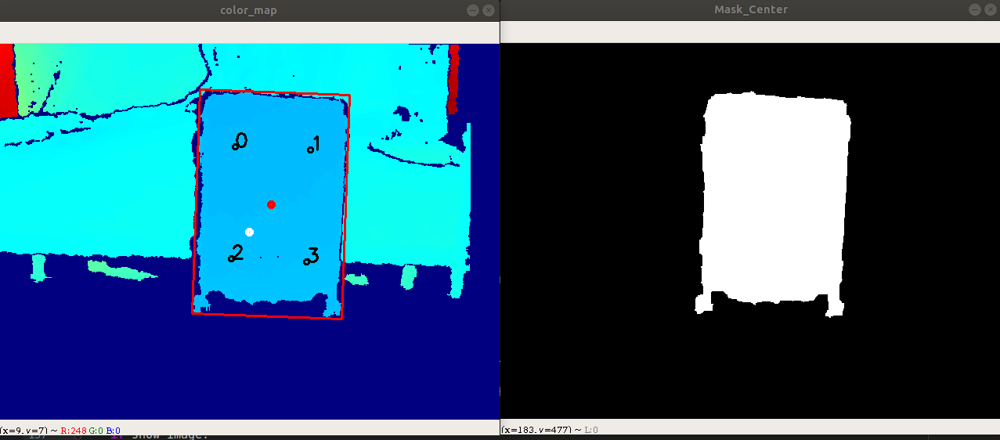
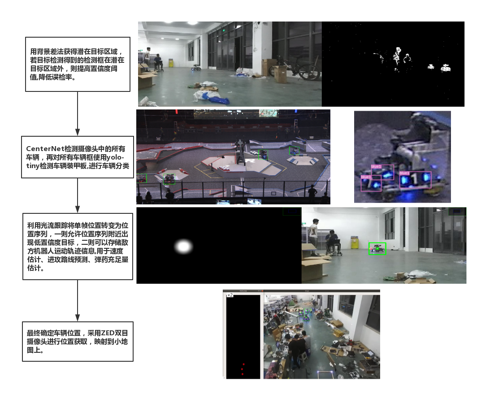

# RoboMaster OnePointFive 2020 项目开源

所有项目效果可以观看B站视频：https://www.bilibili.com/video/BV1Sf4y117MZ

主要包含了工程车自动对位，雷达站标注软件以及预研的主动小陀螺。

如有任何问题或改进方法，欢迎与我联系：1206413225@qq.com


## 1. 工程自动对位项目

### 1.1 项目介绍

​		使用D435进行资源岛寻找，控制工程车运动到资源岛前。

​		资源岛寻找中，采用深度图作为数据输入，以空间中一个75cm宽的竖直平面作为资源岛特征，最后通过串口控制车辆，完成资源岛自动对位任务。

​		具体效果在视频3:25-4:10

 

### 1.2 技术细节说明

#### (1) **Version1:**

​		为了获取资源岛的矩形框,我们直接选取图像中心点作为深度阈值,索引深度阈值±5cm的点,再进行形态学操作.

​		如图所示，图中红色点为行李箱的正中心点，而白色点为图片中心点，以白色点的深度为阈值，索引中间正负5cm的点，再进行一些形态学操作，就可以得到右边图所示的轮廓图




#### (2) Version2:

​		在第一版本中,仅适用正对资源岛的情况,同时还容易由于噪声导致误差,为此,我们假设正中心区域的平面进行判断

1. 选用图像正中心200x100的矩形框的所有点,假定所有点在一平面上,采用最小三乘法确定这些点所在的平面,类似于最小二乘法确定一条线.
2. 计算全深度图的每个点到此平面的距离,索引距离不超过5cm的点,从而得到潜在资源岛矩形框
3. 最终获取矩形框的空间位姿,进行对位


#### (3) Version3:

​		第二版基本上只要正对就可以找到资源岛,但是仍然需要正对,为此,我们继续优化.我们一开始没有发现资源岛的时候直接在图中左中右位置进行矩形区域寻找,一旦找到资源岛的平面,我们就采用资源岛中心的区域作为下一帧寻找的位置,从而最终可以实现自动对位.

​		另外,顺嘴一说,在Version1和Version2中的算法验证我们采用的是乐视的深度相机,换成D435后,深度视野(FOV)得到了极大的提高,但是深度成像素质却大幅度下降,为此我们进行了许多滤波才提升到可以用的效果.如果不是为了能在近处仍可以看完资源岛,乐视的深度相机反而是更好的选择.


​																(最终识别效果图)


### 1.3 工程代码说明

> 所有代码在ToStation中,同时配备了UML图(ToStation/ToStation_UML.png)进行工程说明,可以考虑参考UML图进行工程理解

整体工程主要包含了Detect.py,Message.py,Move.py和tools.py.

**Detect.py:**

​	包含了RS和Detect两个类,RS用于使用相机进行通信,Detect用于寻找资源岛

**Message.py:**

​	主要是用于发送移动位置,这个需要每个队伍自行定义.

**Move.py:**

​	其中主要是Move类,该类基于Detect类识别到的资源岛进行PID运动控制,运动到目标

**tools.py:**

​	主要是提供了一些常用的功能函数


## 2. 小地图自动标注软件

### 2.1 项目介绍

​		在雷达站工作中,为了避免在赛场上临时做数据需要大量的人力,为此我们写了一个自动标注软件,帮助标注人员尽快进行标注.
​		可以生成基于神经网络识别的BBOX,目标跟踪的BBOX以及背景做差的BBOX.还包含了数据集增强,支持BBOX增多,颜色变换等.最后还可以生成不同格式的数据集,支持COCO数据集,tensorflow给的model中的XML格式以及YOLO的txt格式.


### 2.2 项目细节说明

> 此部分原理比较简单,因此也顺手说上雷达站识别的方案

**雷达站识别思路:**



​		雷达站识别中,我们采用CenterNet作为主要网络,YOLOv3作为装甲板的识别,但是最终刷点的是采用了背景差.定位中我们直接使用ZED进行定位,视频中的仓库长度为28m,因此远距离的定位的确非常枓,但是近距离(15m内),精度是足够的

#### (1) 识别方案

​		一开始使用了YOLOv3直接识别,识别种类分为了5类:大红,小红,大蓝,小蓝,灰车.但是发现YOLOv3在小目标检测上效果并不好,另外有遮挡的情况下效果并不理想

​		进而我们采用了CenterNet,并且识别变为了先对全场上的机器人进行识别,分割机器人ROI后,在ROI上再使用yolov3做装甲板识别.泛化性实验中,我们对官方提供的数据集进行区分,训练和验证的分开,单类的识别达到了97%的mAP.另外,我们基于官方数据集训练出的结果,对我们全新的车辆进行识别,在15m内是可以完成识别的.

​		进而,实际测试中,为了降低网络的漏检和误检测,我们用了很好用的背景差法.

1. 取视频第一帧作为背景,以后每一张图片与第一帧做差,得到背景差图
2. 允许CenterNet的识别到的ROI的置信度只有10%,计算背景差图中对应ROI区域的有值的比例,将ROI置信度与有值比例进行相加,得到最终的置信度,我们对置信度大于0.8的ROI作为真值.

另外,我们还希望使用光流跟踪,将识别变为序列跟踪问题,可惜最后时间不够,只是完成了光流跟踪部分的任务


#### (2) 定位方案

​		最终是使用ZED进行定位.期间尝试过像素打表的方法,但是这种方法对标定要求极高,另外远处误差直线上升,因此最终只是使用了ZED


​	

​		

### 2.3 工程代码说明

​		代码主要集中在GUI.py,DataAugment.py,Annotation.py以及DataProcesser.py

**GUI.py:**

​		主要基于tkinter制作GUI界面,另外其中调用了Annotation, DataAugment, DataProcesser, GenerateDataset这四个类

**Annotation.py:**

​		这里面完成了标注的基本任务.Annotation.py中包含了Annotation_Mission(标注任务线程),Annotation_File(标注单张图片),See_Annotation_Mission(查看标注效果)三个主要功能函数.具体可以看注释了解这三个函数的具体实现,从而方便理解.

​		另外,里面继承了BaseDetector,MyDetector是完成代码的实际样例,需要完成BaseDetector中的几个方法的实现才可以进行使用

**DataAugment.py:**

​		这里面进行了数据增强的任务.主要的任务增强函数是aug_color_motion和aug_more_bboxes,分别是进行了颜色变换和标注框变换,从而让图像可以学到更多的信息.

**DataProcesser.py:**

​		DataProcesser中包含了DataProcesser类和GenerateDataset两个类,DataProcesser类用于确保数据集是正确的,以及进行基本的数据集清洗工作,确保一张图片一个txt标注信息.GenerateDataset中包含了多种数据集的生成,目前实现了Json文件,Csv文件以及YOLOv3的txt文件(ArmorFile)


### 2.4 使用说明

> 整体思想是尽可能快地生成数据集,简单标注了100-200张图片后,采用数据增强翻倍数据集之后,让网络基于已有网络进行训练,基于新的训练网络重新进行新的标注.
>
> 需要使用,主要要修改MyDetector,另外还有一些路径问题需要修改.此处主要使用CenterNet作为样例代码进行实现

#### 2.4.1 任务启动

​		主要是启动GUI.py,GUI需要初始化数据集的名称(Dataset_Name),如果最新没有该数据集保存文件夹,则会在code的同目录下生成一个Dataset_Name的文件夹,其下会包含aug和dataset两个文件夹,分别用于存放增强的数据集和标注数据集.他们两个文件夹下面都会包含images和image_annotations两个文件夹,存放图片和txt的数据格式

```
格式
images中有1.jpg,image_annotations中会有对应的1.txt
标注格式为:
1,711,296,835,397,
第一个代表类别,后面4个代表矩形框
```


​		解决代码之后就会有一个标注的GUI界面


#### 2.4.2 GUI使用

##### (1) 选择数据源

​		可以选择已有数据或视频,如果是视频,可以指定采样间隔,即间隔n帧进行一次图片保存.如果是已有数据集,则会把选择数据源路径中的图片和标注全部复制到Dataset_Name的文件夹下


##### (2) 开始标注

​		可以选择是否使用目标跟踪,但是主要是目标检测,里面可以指定识别车辆,装甲板,另外需要显示已标注,从而更好地查看效果

标注时:

​	点击开始标注即可开始,如果选择了使用跟踪,则会有ROI区域进行选择.使用了OpenCV里面的selectROIs,回车确定,ESC完成标注,之后直接在图片中输入标注种类即可,也是采用cv.waitKey进行数字读取


(标注界面,左边中,框左下角标识说明是跟踪结果,左上角结果是识别结果)

t是选择跟踪结果,点击t后,右边会出现两个跟踪框


输入数字是选择神经网络识别效果,左上角的开头数字代表识别置信度顺序,0表示只选择第0个,1表示选择0,1两个标注框


最终,输入s即可保存对应bbox的结果.如果右边没有bbox,则保存会失败

输入c,则在界面上清空选择的bbox,可以进行重新选择


###### 按键说明

> 按键全部是基于cv.waitKey进行处理的,里面的功能非常多,也可以自定义按键指令进行控制


##### (3) 数据增强

对Dataset_Name/dataset中的文件进行数据增强,生成是文件保存在aug中,包含了亮暗操作和目标增多两个操作


##### (4) 生成数据集

最终,进行数据集生成,数据集生成中,会把没有标注信息的图片进行删除,再生成数据集,数据集也生成在Dataset_Name目录下


### 2.5 bug说明

> 由于这部分采用的是CenterNet作为识别样例,内部或多或少会遇到一些问题,

1. DCN方面问题:

     需要到lib/CenterNet/lib_oneclass/models/networks/DCNv2中,先删除build,然后重新执行./make.sh(需要注意,此时python环境要与执行环境相同)

     在进行python test.py,虽然会报错,不过应该不影响使用

2. 网络导入问题

     在MyDetector中,需要重新指定model_path.这里面,需要放置在CenterNet_FIle/CenterNet_CK/exp/ctdet/coco_dla的目录下,百度网盘连接:

     ```
     链接: https://pan.baidu.com/s/11CE55pG4dqt3pEAIKi7EzQ 
     提取码: mvtq 
     ```

     如果进行装甲板数据标注,同时也需要指定yolo的path

     


# 个人广告

另外，本人对机械人抓取非常感兴趣，主要工作在机器人感知与决策上，如果有同方向的朋友，也非常欢迎与我交流！

研究生阶段会去武汉大学李淼老师处继续学习抓取相关的知识，